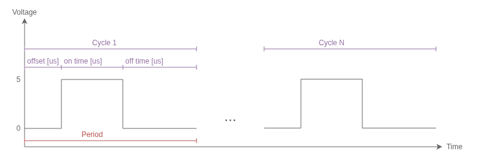

An 8-channel TTL input-or-output device with programmable square wave output

## Features
* 8x TTL input or output, configurable.
* Direct PC control of IO Pins:
  * set pins configured as output to either HIGH (5V) or LOW (0V)
  * read the state of pins configured as inputs as either HIGH (~5V) or LOW (~0V) at TTL logic levels.
* Programmable square wave generation with many configurable settings:
  * PWM Frequency range: from 0.01Hz to 2KHz
  * Duty Cycle
  * Offset
  * number of pulses (or infinite)
* Input Capture Configure pins as inputs to detect
  * rising edges (up to 500Hz)
  * falling edges (up to 500Hz)
  * both! (up to 500hz)
* Harp-protocol compliant (serial num: 0x057B).
* Bonus: "passthrough buffer mode." External 3.3V and 5V CMOS devices can use this device as an octal buffer with external pins.

> [!NOTE]
> This board produces digital outputs and measures digital inputs only! For producing high fidelity _analog_ outputs, refer to the [harp.device.quac](https://github.com/AllenNeuralDynamics/harp.device.quad-dac) device.

## Extra Features
* 6-24VDC input (2.1 x 5.5mm barrel jack, positive center)
* reverse polarity protection
* soft start
* isolated USB to avoid forming ground loops with the PC.

## PWM Waveform Setup
Each IO pin is capable of producing a PWM output. Here are the settings available:
* _offset_us_: how long (in microseconds) the output should remain LOW before switching the output HIGH in one period.
* _on_duration_us_: how long (in microseconds) the output should remain HIGH in one period.
* _off_duration_us_: how long (in microseconds) the output should remain LOW in one period.
* _cycles_: how many pulses to produce or zero for infinite pulses until disabled.
* _invert_: whether the output should be inverted (on-time refers to the output being LOW instead).

> [!NOTE]
> Although multiple PWM channels can be set to different settings and produce outputs concurrently, all PWM outputs must be started at the same time.

